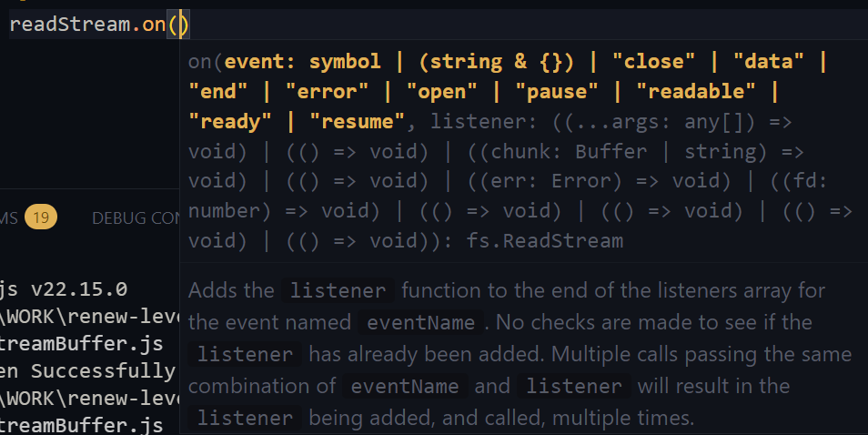

In this module, you’ll start by understanding the event-driven heart of Node.js and explore how it handles tasks synchronously and asynchronously, especially when it comes to reading files, working with buffers, and streaming data efficiently.

But that’s just the beginning…

By the end of this module, you’ll be:

- Building your own logger app to track `events and activities`
- Navigating the filesystem using the `Path module`
- Creating a basic ToDo app using Node’s `native HTTP server`
- Implementing `routing`, setting `custom response headers`, and using Postman to test your `API`
- Handling `CRUD operations` (Create, Read, Update, Delete) on ToDos with real HTTP requests—query params and all!

This module bridges the gap between learning and doing. It's where you transform knowledge into projects, gain confidence in Node.js fundamentals, and start thinking like a real backend developer.

Let’s go—your first full Node-powered app is just a few lessons away!

## 13-1 What is an event module?

- Node.js Follows Event Driven Architecture.
- Event Loop Plays an important role.
- Event Loop Always Looks for if any event/ user request/ action is running or not.
- Event Loop performs the task sending to thread pool. when task is done event loop send response through a callback function.
- When its I/O Intensive task it sends to thread pool and when its cpu intensive task Its done in main thread.

### Lets see in practical

- In event loop we get `event listener` which listens all the events and performs tasks and send response.
- We also get a `event emitter` which triggers the events.

[Node.js Events](https://nodejs.org/api/events.html)

- less play with this considering a school bell

```js
// 📢 Step 1: Import the EventEmitter class from Node's built-in 'events' module
const EventEmitter = require("node:events");

// 🛒 Step 2: Bought a school bell from the shop by creating a class that can emit events
//           'SchoolBell' extends EventEmitter so it can emit and handle events like 'ring' or 'broken'
class SchoolBell extends EventEmitter {}

// 🔔 Step 3: Set up the bell (create an instance of the SchoolBell)
//           This 'schoolBell' is our event emitter (it will emit or broadcast events)
const schoolBell = new SchoolBell();

// 👂 Step 4: Students are now listening for the school bell to ring or break

// 📚 Listener 1: A student hears the bell ring and responds
schoolBell.on("ring", () => {
  console.log("🎒 Wow! Class session started!");
});

// 📚 Listener 2: Another student hears the bell ring and gives a different response
//               👉 This shows multiple listeners for the same event ('ring')
schoolBell.on("ring", () => {
  console.log("📓 Aha! Another class is coming up!");
});

// 😩 Listener 3: A student reacts when the bell is broken
//               👉 This shows we can have different types of events on the same emitter
schoolBell.on("broken", () => {
  console.log("😩 Will this class ever end?");
});

// 🏫 Step 5: The bell starts ringing and breaks

// 🔔 Emit the 'ring' event → all registered listeners for 'ring' will respond
schoolBell.emit("ring"); // Students react to the first bell ring

// 🔔 Emit 'ring' again → same listeners react again
schoolBell.emit("ring"); // Students react again for another bell

// 💥 Emit 'broken' event → only the listener for 'broken' responds
schoolBell.emit("broken"); // One student reacts to the broken bell
```

- we can create multiple listener (ring, broken) on one event and the listeners will give different different callback response.
- we can also create multiple event listener based on one event emitter like ring is returning two responses.

| Concept                | Example in Code                        | Description                               |
| ---------------------- | -------------------------------------- | ----------------------------------------- |
| **Emitter**            | `schoolBell`                           | An object that triggers events (`emit`)   |
| **Event**              | `"ring"`, `"broken"`                   | Named signals you emit                    |
| **Listener**           | `schoolBell.on("ring", () => { ... })` | A function that reacts to an event        |
| **Multiple Listeners** | Two `on("ring", ...)`                  | More than one response for a single event |
| **Multiple Events**    | `"ring"`, `"broken"` on `schoolBell`   | One emitter can have different events     |

#### use case of event module in node.js

1. 🔄 _Asynchronous Operations_

- File I/O: Emits events like open, data, end, error for non-blocking file handling.
- HTTP Requests: Emits request, response to handle multiple web requests concurrently.
- Streams: Emits data, end, error, finish while reading/writing data in chunks.

2. 🧠 _Custom Events_

- Application Logic: Trigger actions based on user interactions or app state changes.
- Inter-Process Communication: Pass messages between services or app modules.
- Modular Code: Decouple components for cleaner, maintainable architecture.

3. 📦 _EventEmitter Class_

- Core Class: Built-in EventEmitter from events module handles all event-based ops.

_Methods_:

- .emit('event') – Trigger an event
- .on('event', callback) – Listen for an event
- .removeListener() / .removeAllListeners() – Clean up listeners
- Async Support: Event handlers can be async for non-blocking behavior.

## 13-2 Synchronous way to read and write files

- This file system means we can read the data from our machine where the files are stored.
- We can also create new files in our machine and do data entry. And we can do update and delete the data.

### Lets see how we can read the data from Machine using File system

[Filesystem Of Node.js](https://nodejs.org/api/fs.html)

- we can read data in `Synchronous` way. here we will tell node.js files system the file path and tell him to grab the data. This operation will happen in `Single Thread/ Main Thread` because the synchronous works are not sent in `thread pool`. An this will block the single thread until the task is finished.

#### Synchronous File System `Read`

[Read File sync Blog](https://www.geeksforgeeks.org/node-js-fs-readfilesync-method/)

```js
fs.readFileSync(path[, options])
```

- read file system

```js
const fs = require("node:fs");
//  synchronous
const data = fs.readFileSync("./hello.txt", { encoding: "utf8" });
// if we do not giv the option it will show buffer <Buffer 48 65 6c 6c 6f 20 49 20 61 6d 20 52 65 61 64 69 6e 67 20 54 68 65 20 74 65 78 74>
console.log(data);
```

- it will grab the text from the `hello.txt` file and show.

#### Synchronous File System `Write`

```js
fs.writeFileSync(file, data[, options])
```


```js
const fs = require("node:fs");

const text = "Learning File System";
fs.writeFileSync("./hello.txt", text);
const data = fs.readFileSync("./hello.txt", { encoding: "utf8" });
console.log(data);
```

#### Now Lets Understand how its blocking other process.

```js
const fs = require("node:fs");

console.log("Task-1");
const text = "Learning File System";
fs.writeFileSync("./hello.txt", text);

console.log("Task-3");

const data = fs.readFileSync("./hello.txt", { encoding: "utf8" });
console.log("Task-4");
console.log(data);
```

#### Asynchronous File System

- we can read data in `Asynchronous` way. This operation will happen in `Thread Pool`.File read --> single thread --> event loop --> thread pool --> finish task and send response

- `readFile` works on asynchronous way by default.

## 13-3 Asynchronous way to read and write files

#### Asynchronous File System `Read`

[Async Read](https://www.geeksforgeeks.org/node-js-fs-readfile-method/)

```js
fs.readFile(path, options, callback);
```

- As its asynchronous operation it will be solved by thread pool. so we need a callback here as well. Callback helps to send response of the complete task to user.


```js
const fs = require("fs");

fs.readFile("example.txt", "utf8", (err, data) => {
  if (err) {
    console.error("Error reading file:", err);
    return;
  }
  console.log("File contents:", data);
});
```

- This called error back pattern, if there is any error it will show the error.
- now lets see our made asynchronous read example

```js
const fs = require("node:fs");
let texts = "Default Text before set by callbacks";
console.log("Asyn Task-1");

fs.readFile("./hello.txt", { encoding: "utf8" }, (err, data) => {
  if (err) {
    console.log("Opps!! Error Occurred.", err);
    return;
  }
  texts = data;
  console.log(texts, "Text Inside Callback");
});
console.log(texts);
console.log("Asyn Task-3");
```

#### Asynchronous File System `Write`

[Write File Async](https://www.geeksforgeeks.org/node-js-fs-writefile-method/)

```js
fs.writeFile(file, data, options, callback);
```

- lets see wite and read of async

```js
let texts = "Default Text before set by callbacks";
console.log("Asyn Task-1");

fs.writeFile("./hello.txt", texts, { encoding: "utf-8" }, (err) => {
  if (err) {
    console.log("Opps!! Error Occurred.", err);
    return;
  }
  console.log("Written Successfully!");
});

fs.readFile("./hello.txt", { encoding: "utf-8" }, (err, data) => {
  if (err) {
    console.log("Opps!! Error Occurred.", err);
    return;
  }
  texts = data;
  console.log(texts, "Text Inside Callback");
});
console.log(texts);
console.log("Asyn Task-3");
```

## 13-4 Buffer and Streaming

- **Streaming :** Streaming is Process by using which we can transfer data from one place to another place.
- **Buffer :** While doing streaming It is used to process a data piece by piece which is called buffer.

#### Lets understand using an example

- Think of it like a pizza. we are slicing one by one and then giving everyone one by one.
- In youtube we have full data/ video. The full video is not loaded at a time since it will take time to show. They came up with a solution like they will divide the pizza in different pieces and then each piece comes to user end one by one. For this reason which pice has came its showing to us by this time other pieces gets loaded. User Gets smooth experience.

#### Benefits of Streaming and Buffer.

- Better In terms of User Experience
- Needs short memory storage as it do not complete whole process at once. since ram memory is temporary and its short. some piece of data gets loaded and its kicked off and then other enters the temporary memory.

#### Different Types Of Streams

1. **Readable Stream :** a stream where we can read data (ex. http req, fs.readStream)
2. **Writeable Stream :** a stream where we can Write data (ex. http response, fs.writeStream)
3. **Duplex Stream :** a stream for both read and write.
4. **Transform Stream :** a stream where we can reshape data.

### Lets see stream and buffer in practical

```js
let texts = "Default Text before set by callbacks";
console.log("Asyn Task-1");

fs.writeFile("./hello.txt", texts, { encoding: "utf-8" }, (err) => {
  if (err) {
    console.log("Opps!! Error Occurred.", err);
    return;
  }
  console.log("Written Successfully!");
});

fs.readFile("./hello.txt", { encoding: "utf-8" }, (err, data) => {
  if (err) {
    console.log("Opps!! Error Occurred.", err);
    return;
  }
  texts = data;
  console.log(texts, "Text Inside Callback");
});
console.log(texts);
console.log("Asyn Task-3");
```

- suppose we want this like we will read and immediately write. In this code case of asynchronous we can not take the data out of the block and cant store in variable. so we have to write inside callback

- suppose we want to read the hello.txt data and make it duplicate and write inside hello-world.txt

```js
const fs = require("node:fs");

fs.readFile("./hello.txt", { encoding: "utf-8" }, (err, data) => {
  if (err) {
    console.log("Opps!! Error Occurred.", err);
    return;
  }

  fs.writeFile("./hello-world.txt", data, { encoding: "utf-8" }, (err) => {
    if (err) {
      console.log("Opps!! Error Occurred.", err);
      return;
    }
    console.log("Written Successfully!");
  });
});
```

- Here first the file is read fully and then write is done. as the data is not that big so its not issue here. but if there is a lot of data there will be a problem since we will cost time. we know read speed is faster than write speed. This will create a back pressure for large data and creating imbalance.

#### Here Streaming comes with a solution. read and write will be done in streaming format like duplex stream.

[Files System Read Stream](https://nodejs.org/api/fs.html#filehandlecreatereadstreamoptions)

[Blog Of Read Stream](https://www.geeksforgeeks.org/node-js-fs-createreadstream-method/)

[Blog Of Write Stream](https://www.geeksforgeeks.org/node-js-fs-createwritestream-method/)

```js
fs.createReadStream(path, options);
fs.createWriteStream(path, options);

readStream.on();
```

```js
const fs = require("node:fs");

const readStream = fs.createReadStream("./hello.txt", { encoding: "utf-8" });
const writeStream = fs.createWriteStream("./hello-world.txt", {
  encoding: "utf-8",
});

// as we have created event we will need a listener for the event
readStream.on("data");
```

- as we have created readStream event we will need a listener for the event
- when were are reading the data readStream event will be triggered.
- While we are loading data the readStream will listen and will show the loaded piece of data.

  

  

- When the event is data there will be function named listener. this function will give us the data.

  

```js
const fs = require("node:fs");

const readStream = fs.createReadStream("./hello.txt", { encoding: "utf-8" });
const writeStream = fs.createWriteStream("./hello-world.txt", {
  encoding: "utf-8",
});

readStream.on("data", (data) => {
  console.log(data);

  writeStream.write(data, (err) => {
    if (err) {
      console.log("Opps!! Error Occurred.", err);
      return;
    }
  });
});
```

- here we are catching the error of write stream but we have nothing for catching the error of read stream.node.js have got us we can read stream and write stream error delicately.

```js
const fs = require("node:fs");

const readStream = fs.createReadStream("./hello.txt", { encoding: "utf-8" });
const writeStream = fs.createWriteStream("./hello-world.txt", {
  encoding: "utf-8",
});
// readStream.on("eventName", callback);
readStream.on("data", (data) => {
  console.log(data);

  writeStream.write(data, (err) => {
    if (err) {
      console.log("Opps!! Error Occurred.", err);
      return;
    }
  });
});

readStream.on("error", (err) => {
  if (err) {
    throw Error("Error", err);
  }
});

// we have checked the write error but we can also check here like this.
writeStream.on("error", (err) => {
  if (err) {
    throw Error("Error", err);
  }
});
```

| **Event**        | **When it Happens**                                                  | **Callback Signature**      | **Description**                                                                |
| ---------------- | -------------------------------------------------------------------- | --------------------------- | ------------------------------------------------------------------------------ |
| **`"data"`**     | When a chunk of data is available to read                            | `(chunk: string \| Buffer)` | Emitted multiple times as data is streamed                                     |
| **`"end"`**      | When there is no more data to read                                   | `() => void`                | Indicates the stream has finished reading                                      |
| **`"error"`**    | When an error occurs while reading or writing                        | `(err: Error) => void`      | Always listen for this to avoid uncaught exceptions                            |
| **`"close"`**    | When the stream and underlying file descriptor are closed            | `() => void`                | Emitted after `end`, when stream is completely cleaned up                      |
| **`"open"`**     | When the file descriptor is successfully opened                      | `(fd: number) => void`      | Useful for tracking access to the file descriptor                              |
| **`"pause"`**    | When the readable stream is paused                                   | `() => void`                | Happens after calling `.pause()`                                               |
| **`"resume"`**   | When the readable stream is resumed after being paused               | `() => void`                | Happens after calling `.resume()`                                              |
| **`"readable"`** | When a readable stream has data available for manual `.read()` calls | `() => void`                | Allows for manually reading data in a loop                                     |
| **`"ready"`**    | When the stream is ready for use                                     | `() => void`                | Emitted only once, before any data events                                      |
| **`"drain"`**    | When the write buffer becomes empty                                  | `() => void`                | Used in write streams to handle backpressure (after `.write()` returned false) |
| **`"finish"`**   | When all data has been flushed from the write stream                 | `() => void`                | Emitted after `.end()` is called                                               |
| **`"pipe"`**     | When a readable stream is piped into a writable stream               | `(src: Readable) => void`   | Indicates piping has started                                                   |
| **`"unpipe"`**   | When a readable stream is unpiped from a writable stream             | `(src: Readable) => void`   | Emitted when `.unpipe()` is called                                             |

- Now we want to show a success message while completed the write stream.

```js
const fs = require("node:fs");

const readStream = fs.createReadStream("./hello.txt", { encoding: "utf-8" });
const writeStream = fs.createWriteStream("./hello-world.txt", {
  encoding: "utf-8",
});
readStream.on("data", (data) => {
  console.log(data);

  writeStream.write(data, (err) => {
    if (err) {
      console.log("Opps!! Error Occurred.", err);
      return;
    }
  });
});

readStream.on("error", (err) => {
  if (err) {
    throw Error("Error", err);
  }
});

readStream.on("end", () => {
  console.log("Reading Ended");
  writeStream.end();
});

writeStream.on("finish", () => {
  console.log("Writing Is Finish");
});
```

## 13-5 Making a basic logger app & Path module

- so far we have learned IIFE. now we know how node.js uses IIFE and gives use access of some other method that are not present in global object.
- We get `__dirName`, `module`, `module.export`, `require` etc.
- We get another one named `process`. this gives us a lot of things in process. if we console it we can see.
- Here is a magic inside process if we console `console.log(process.argv)`. this gives us an array and the array shows us the location of node executable file and the location of the file we are running.
  
- we are telling that go the file location and run the file using the exe file.
- If we run this `node index.js Hello Shanda`. it will show array and also capture the two words


- suppose we do not want the path names we just want the words. we have to use slice method.

```js
const inputArguments = process.argv.slice(2);

console.log(inputArguments);
```


- we can bring them into single sentence using join

```js
const text = inputArguments.join(" ");
console.log(text);
```

- If there is no input we have to close the server. using `process.exit(1)`

```js
if (!text) {
  console.log(
    "❌ Ballerina Kapuchina! Me me me me ! Please Provide a message To Log !"
  );
  console.log("Example : Node index.js Hellow World!");
  process.exit(1);
}
```

- now lets make a place for storing the data we have gave.

```js
const filePath = __dirname + "/log.txt";
// D:\WORK\renew-level-2\PH-MODULES\Be-An-Express-And-Mongoose-Master\Explore-Nodejs-Core-Modules\codes\logger-app/log.txt
// this will join the path thought there is wrong with "\" so we can use join.
```

- concat will join the path but there ie a problem with "\" so using `path.join` is better solution

```js
const path = require("path");
const filePath = path.join(__dirname, "log.txt");

console.log(filePath); // D:\WORK\renew-level-2\PH-MODULES\Be-An-Express-And-Mongoose-Master\Explore-Nodejs-Core-Modules\codes\logger-app\log.txt
```

- now place is created for storing the input values.
- now we have to add the inputs with the existing data of log.txt file.
- Asynchronously append data to a file, creating the file if it does not yet exist. data can be a string or a Buffer.


#### Final Version Of Logger

```js
const path = require("path");

const fs = require("node:fs");

console.log(process.argv);

const inputArguments = process.argv.slice(2);

console.log(inputArguments);

const text = inputArguments.join(" ").concat("\n");

const timeStamp = new Date().toString();

console.log(timeStamp);

const message = `${text} ${timeStamp} \n`;

if (!message) {
  console.log(
    "❌ Ballerina Kapuchina! Me me me me ! Please Provide a message To Log"
  );
  console.log("Example : Node index.js Hellow World!");
  process.exit(1);
}
console.log(message);

// const filePath = __dirname + "/log.txt"
// D:\WORK\renew-level-2\PH-MODULES\Be-An-Express-And-Mongoose-Master\Explore-Nodejs-Core-Modules\codes\logger-app/log.txt
// this will join the path thought there is wrong with "\" so we can use join.
// console.log(filePath)

const filePath = path.join(__dirname, "log.txt");

console.log(filePath); // D:\WORK\renew-level-2\PH-MODULES\Be-An-Express-And-Mongoose-Master\Explore-Nodejs-Core-Modules\codes\logger-app\log.txt

fs.appendFile(filePath, message, { encoding: "utf-8" }, () => {
  console.log("Your Log Added Successfully!");
});
```

- input

```
 Node index.js Hellow World!"
```

## 13-6 Creating a todo app with basic http server using nodejs

- Lets create a server using node.js. For creating server we must connect with our machine network. and this connection is done using node.js `HTTP` Module.

[HTTP Module](https://nodejs.org/api/http.html)

```js
http.createServer([options][, requestListener])
```

[http module createServer](https://nodejs.org/api/http.html#httpcreateserveroptions-requestlistener)

- Here we call http and give a callback function inside. This callback function handles request and response.

```js
const http = require("node:http");

// Create a local server to receive data from
const server = http.createServer((req, res) => {
  res.writeHead(200, { "Content-Type": "application/json" });
  res.end(
    JSON.stringify({
      data: "Hello World!",
    })
  );
});

server.listen(8000);
```

- lest create this server for our to do app.

```js
const http = require("http");

const server = http.createServer((req, res) => {
  res.end("Welcome To Server");
});

server.listen(5000, "127.0.0.1", () => {
  console.log("Server Is Listening");
});
```

- we can console.log the request and response. we will get after postman hit

```js
const server = http.createServer((req, res) => {
  console.log({ req, res });
  res.end("Welcome To Server");
});
```

- These will show all the details of the request and response having.
- We will use some of them like `res.end`, `req.headers`
